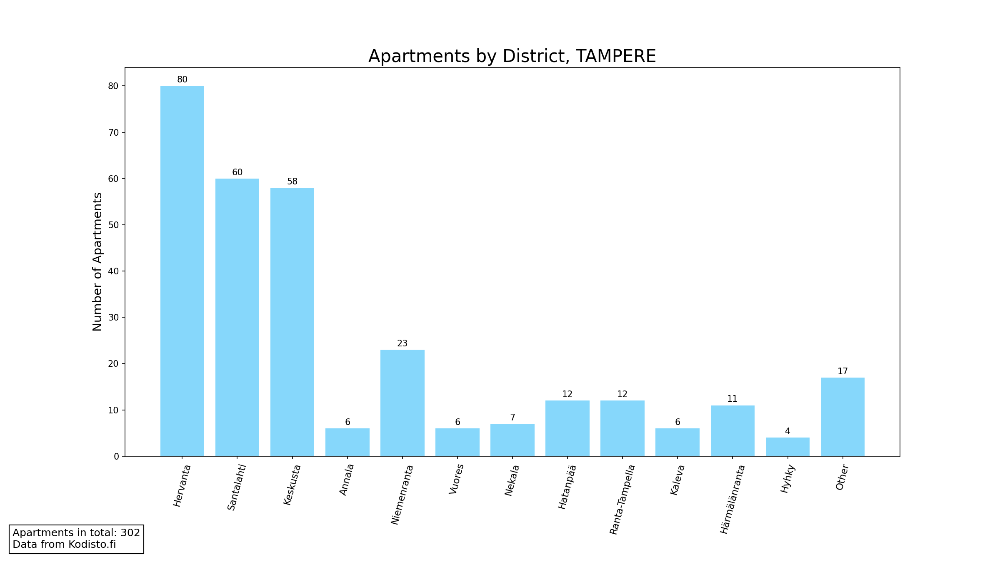

# Analysis of Apartments for rent in Finland

## What it does
Using a reliable data to get info about apartments for rent in Finland the script does some Pandas magic on it. As the result, it creates six plots.   
Fist of them illustrating distribution of apartments per city in Finland and how many apartments of each type are there. By type I mean the number of rooms. Here's an example:
  

   
Each of the other five plot represent data for one of the five cities in Finland that have the largest number of available apartments. Each plot displays the number of apartments per city district. 
  

   

## How it works
- The script makes a request to [Kodisto.fi](https://kodisto.fi/)
- Transforms data for each apartment in a class instance and saves info in a csv file
- Creates a general-purpose Dataframe from the csv
- Creates specific Dataframe using filtering and aggregating for each plot
- Creates plots using Matplotlib and saves them as pngs
   

## Technology Stack
- **Requests** library for collecting data
- **CSV** and **JSON** modules for processing it
- **Pandas** for data analysing
- **Matplotlib** for creating plots